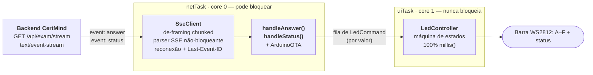

<div align="center">

# CertMind · ESP32-S3 Stream Client

**Firmware para ESP32-S3 Super Mini que traduz o stream SSE da API CertMind numa barra WS2812: 6 respostas (A–F) + 2 pixels de status.**

Uma única conexão HTTP persistente. Dois núcleos — a animação nunca engasga.
Zero `delay()` no caminho de renderização. Zero polling. Zero cabo para atualizar.

<br>


</div>

---

O ESP32 é **apenas consumidor**: abre um `GET`, mantém a conexão viva e escuta.
Não faz `POST`, não envia imagem, não faz request/response.

O backend difunde dois eventos — `answer` (a resposta resolvida) e `status` (andamento do
processamento) — e o firmware transforma cada um em um padrão de LED inconfundível.

```bash
pio run --target upload && pio device monitor
```

### Sumário

[Arquitetura](#arquitetura) ·
[Requisitos](#requisitos) ·
[Montagem](#montagem) ·
[Configuração](#configuração) ·
[Build](#build-upload-e-monitor) ·
[O stream](#o-stream) ·
[A linguagem dos LEDs](#a-linguagem-dos-leds) ·
[Reconexão](#reconexão-automática) ·
[Testes](#testes--critérios-de-aceite) ·
[Problemas](#solução-de-problemas)

---

## Arquitetura

Projeto **PlatformIO** com ambiente único `[env:esp32s3_supermini]` e uma responsabilidade por arquivo.

O trabalho é dividido entre os **dois núcleos** do S3: tudo que pode bloquear (rede, parse)
mora na `netTask`; a barra é animada pela `uiTask` num tick de 5 ms — ligadas por uma fila de
comandos **por valor**. É por isso que a animação não congela nem durante um `connect()` de 5 s.



| Módulo | Responsabilidade |
|---|---|
| `src/Config.h` | Toda a parametrização via `#define`: WiFi, endpoint, barra de LED, timings dos padrões, backoff, tetos de buffer, OTA. |
| `src/ConfigStore.{h,cpp}` | Configuração persistente em **NVS**: overrides de WiFi/endpoint por cima dos defaults do `Config.h`, ajustáveis pela CLI serial. |
| `src/WiFiManager.{h,cpp}` | Conexão WiFi inicial (modo STA, modem sleep desligado) e helpers de status. |
| `src/SseClient.{h,cpp}` | Abre o `GET`, valida headers, desmonta o `Transfer-Encoding: chunked`, faz o parser SSE linha-a-linha sem bloquear, reconecta com backoff e pede replay via `Last-Event-ID`. |
| `src/LedController.{h,cpp}` | Máquina de estados da barra (6 respostas + 2 status) — todo o tempo medido em `millis()`, nenhum `delay()`. |
| `src/main.cpp` | Liga os módulos e divide o trabalho entre os 2 núcleos: rede/parse/OTA na `netTask` (core 0), LEDs + CLI serial na `loop()`/uiTask (core 1), unidas por uma fila de comandos por valor. |

> Detalhamento interno (diagramas de estado, orçamento de memória, decisões de projeto):
> **[ARCHITECTURE.md](ARCHITECTURE.md)**. Diretrizes para assistentes de IA: **[CLAUDE.md](CLAUDE.md)**.

---

## Requisitos

<table>
<tr><th align="left">Hardware</th><th align="left">Software</th></tr>
<tr valign="top"><td>

- 1× **ESP32-S3 Super Mini** (ESP32-S3FH4R2 — 4 MB flash + 2 MB PSRAM)
- 1× **Barra WS2812 de 8 LEDs** (endereçáveis)
- Jumpers e cabo USB-C (dados + alimentação)

</td><td>

- **[PlatformIO](https://platformio.org/)** — CLI ou extensão do VS Code
- A plataforma `espressif32`, o **ArduinoJson 6.x** e o **FastLED** são baixados automaticamente a partir do `platformio.ini`

</td></tr>
</table>

> [!IMPORTANT]
> O firmware usa a rede em **2,4 GHz** (o rádio WiFi do ESP32-S3 é só 2,4 GHz).

---

## Montagem

A barra WS2812 usa **um único pino de dados** (GPIO 13). Cada posição de resposta
é um pixel da barra, com a cor que o LED físico tinha no D1 Mini:

| Pixel | Cor | Função |
|:---:|-----|:---------------:|
| **0** | 🟢 Verde    | Resposta 1 / A |
| **1** | 🟡 Amarelo  | Resposta 2 / B |
| **2** | 🔴 Vermelho | Resposta 3 / C |
| **3** | 🔵 Azul     | Resposta 4 / D |
| **4** | ⚪ Branco   | Resposta 5 / E |
| **5** | 🟣 Magenta  | Resposta 6 / F |
| **6** | 🟠 Âmbar / 🟣 Violeta | Status: conexão (âmbar piscando = reconectando; pulso violeta = ocioso, suprimido com resposta em exibição ou multicaptura ativa) |
| **7** | 🩵 Ciano | Status: multicaptura (`capturing`) — respiração ciano enquanto o servidor aguarda a próxima foto; apagado fora dela. O `solving` não usa este pixel: é a varredura vermelha na barra inteira |

```
   ESP32-S3 Super Mini              Barra WS2812 (8 px)
   ───────────────────              ───────────────────
   5V  ────────────────────────▶   VCC
   GPIO 13 ────────────────────▶   DIN   [0][1][2][3][4][5][6][7]
   GND ────────────────────────▶   GND
```

O brilho e o teto de potência ficam em `Config.h` (`LED_BRIGHTNESS`,
`LED_MAX_MILLIAMPS` — limitado a 600 mA para não derrubar a porta USB).

---

## Configuração

Toda a parametrização fica em **`src/Config.h`** — e, desde a v3.5, WiFi e endpoint são
**defaults**: overrides persistidos em NVS (via CLI serial, [veja abaixo](#build-upload-e-monitor))
têm precedência e sobrevivem a reboot.

**Endpoint do stream** — HTTP puro, sem TLS. Em dev local, basta trocar host/porta
(ou, com a placa já gravada, `config set host ...` pela serial — sem recompilar):

```cpp
#define STREAM_HOST "192.168.15.38"
#define STREAM_PORT 8090
#define STREAM_PATH "/api/exam/stream"
```

**Credenciais WiFi:**

```cpp
#define WIFI_SSID     "..."
#define WIFI_PASSWORD "..."
```

<details>
<summary><b>Demais ajustes disponíveis</b></summary>

<br>

| Grupo | Constantes |
|---|---|
| Barra de LED | `LED_BAR_PIN`, `LED_BAR_COUNT`, `LED_COUNT`, `LED_BRIGHTNESS`, `LED_MAX_*`, `LED_COLOR_A` … `LED_COLOR_F` |
| Pixels de status | `LED_PIX_STATUS_CONN`, `LED_PIX_STATUS_PROC`, `LED_COLOR_STATUS_*` |
| Saúde do stream | `STREAM_TIMEOUT_MS`, `HEADERS_TIMEOUT_MS`, `STREAM_BACKOFF_TABLE`, `STREAM_HEAP_LOG_MS` |
| Buffers do parser | `SSE_MAX_LINE`, `SSE_MAX_DATA`, `SSE_MAX_CHUNK`, `SSE_MAX_EVENT_ID`, `SSE_RETRY_MIN/MAX_MS` |
| Conexão / ocioso / boot | `LED_CONN_BLINK_MS`, `LED_IDLE_PERIOD_MS`, `LED_IDLE_PULSE_MS`, `LED_BOOT_BLINK_MS` |
| Resposta retida | `LED_HOLD_TTL_MS`, `LED_HOLD_INTAKE_MS`, `LED_YESNO_BLINK_MS` |
| Processando (varredura) | `LED_SOLVE_COLOR`, `LED_SOLVE_SPAN`, `LED_SOLVE_STEP_MS`, `LED_SOLVE_TRAIL`, `LED_SOLVE_FADE` |
| Multicaptura (respiração) | `LED_CAPTURE_COLOR`, `LED_CAPTURE_PERIOD_MS`, `LED_CAPTURE_STEP_MS`, `LED_CAPTURE_MIN`, `LED_CAPTURE_MAX` |
| Teste / erro / sequências | `LED_CHASE_*`, `LED_ERROR_*`, `LED_SEQ_*` |
| OTA | `OTA_HOSTNAME`, `OTA_PASSWORD` |
| Serial e JSON | `SERIAL_BAUD_RATE`, `JSON_DOC_SIZE` |

O `monitor_speed` do `platformio.ini` precisa bater com `SERIAL_BAUD_RATE` (115200).

</details>

> [!NOTE]
> As credenciais WiFi ficam versionadas em texto plano por decisão do mantenedor.

---

## Build, upload e monitor

```bash
pio run                  # Compila o firmware
pio run --target upload  # Compila e grava via USB-C (porta fixada em COM6 no platformio.ini)
pio device monitor       # Monitor serial (115200 baud)
pio run --target clean   # Limpa artefatos de build
```

**OTA (sem cabo):** descomente o bloco `espota` no `platformio.ini` e o mesmo
`pio run --target upload` passa a gravar pela rede (`certmind-s3.local`, senha `OTA_PASSWORD`
do `Config.h`). Durante o update, roda a varredura vermelha de processamento (barra inteira).

**Configuração em runtime (NVS):** pela serial, `config` mostra os valores em uso;
`config set host 192.168.15.40` (chaves: `ssid`/`pass`/`host`/`port`/`path`) persiste um
override que vale após `restart`; `config clear` volta aos defaults do `Config.h`.
Uma troca de IP do backend se resolve sem recompilar.

Não há testes automatizados — é firmware embarcado, validado em hardware pelo Serial Monitor.
A serial sai pelo próprio USB-C (USB-Serial/JTAG nativo, sem adaptador). Para capturar o boot
(que acontece antes de o monitor abrir), force um reset com o monitor já conectado (pulso no
RTS) — o bootloader ROM do S3 não fala pelo USB-CDC, então as primeiras linhas do ROM não
aparecem; o log do firmware em si aparece completo.

---

## O stream

- **Método:** `GET {STREAM_HOST}:{STREAM_PORT}{STREAM_PATH}` → `Content-Type: text/event-stream`
- A conexão é **aberta uma vez e fica viva indefinidamente**; o servidor empurra eventos conforme ocorrem.
- Linhas iniciadas por `:` são comentários de prova de vida — `: connected` na abertura e `: ping` a cada 15 s.
- Apenas `answer` e `status` são tratados; qualquer outro nome de evento é descartado em silêncio.
- O corpo chega em `Transfer-Encoding: chunked` (o backend é Kestrel) e o firmware **desmonta os frames** antes de montar as linhas SSE.

Como o tráfego aparece na linha:

```text
: connected

event: status
data: {"state":"solving","activeSolves":1}

event: answer
data: {"hasData":true,"questionType":"single","letters":["C"],"answerText":"C"}

event: status
data: {"state":"idle","activeSolves":0}

: ping
```

**Sequência normal de um solve:** `status solving` → `answer` → `status idle`.
**Em falha:** `status solving` → `status error` (**sem** `answer`).
Ao abrir a conexão o servidor manda um `status` com o estado atual — reconectar no meio de um
processamento já traz `solving` (ou `capturing`, se houver print parqueado).

**Print parcial (multicaptura, servidor v2.9+):** quando uma foto sozinha não basta para responder
— questão com **vários dropdowns** (só uma lista abre por foto) ou **painel de case study** — o
servidor parqueia o print e aguarda a próxima foto da mesma questão:

```text
event: answer
data: {"hasData":false,"questionType":"test","letters":[],"answerText":"-"}

event: status
data: {"state":"capturing","activeSolves":0}
```

O `capturing` chega logo após o `answer` de `test` ("print recebido") e **substitui o `idle`
final**: vira o estado-base até chegar `solving`, um `answer` real, `idle` (lote limpo) ou `error`.
A foto que fecha o conjunto retoma o fluxo normal: `solving` → `answer` → `idle`.

<details>
<summary><b>Payload do evento <code>answer</code></b> (<code>SolverOutput</code>)</summary>

<br>

| Campo | Tipo | Significado |
|---|---|---|
| `hasData` | bool | `true` se a questão foi lida; `false` se ilegível ou modo Test |
| `questionType` | string | `single`, `multiple`, `yesno`, `dropdown`, `ordering`, `matching` ou `test` |
| `letters` | string[] | Letras A–F (`single` / `multiple`) |
| `flags` | bool[] | Sim/Não por afirmação (`yesno`) |
| `slots` | int[] | Posições 1–6 por slot (`dropdown` / `ordering` / `matching`) |
| `slotCount` | int | Nº de afirmações / lacunas / itens |
| `answerText` | string | Resposta legível (só vai para o log) |
| `explanation` | string | Justificativa — parseada, ainda sem uso (removida do contrato na v2.0.0 do backend) |
| `elapsedMilliseconds` | long | Tempo de processamento no servidor |

Desde a v3.1 (M2) o payload inteiro é desserializado (zero-copy, pool de 4096 bytes) — não há
mais filtro; o uso do pool é logado a cada `answer` (`[JSON] pool=`).

</details>

<details>
<summary><b>Payload do evento <code>status</code></b></summary>

<br>

| Campo | Tipo | Significado |
|---|---|---|
| `state` | string | `solving` (aguardando a IA), `capturing` (print parqueado, aguardando a próxima foto), `idle` (ocioso) ou `error` (o processamento falhou) |
| `activeSolves` | int | Quantas requisições estão em andamento no servidor (informativo, só vai para o log) |

Um `state` desconhecido é tratado como `idle`, conforme a spec.

</details>

---

## A linguagem dos LEDs

Desde a v3.2 a barra tem **dois canais independentes**: os pixels **0–5** carregam só as
**respostas (A–F)**, e os pixels **6–7** são o **status dedicado** (conexão e multicaptura).
Um `answer` novo sempre interrompe a exibição atual; o status nunca interfere na resposta.

```
Notação:   ●  aceso fixo      ◐  piscando      ◐̴  respirando      ·  apagado
Ordem:     A  B  C  D  E  F | S₆ S₇   →  respostas 1–6 | conexão, multicaptura
Cores:     A=verde B=amarelo C=vermelho D=azul E=branco F=magenta
```

### Status — pixels 6 (conexão) e 7 (multicaptura)

| Situação | Pixel | Padrão |
|---|:---:|---|
| Conectando / sem WiFi / reconectando | 6 | Âmbar piscando ~150 ms |
| Conectado, ocioso | 6 | Heartbeat violeta: 1 pulso de ~80 ms a cada ~2 s — **suprimido enquanto uma resposta está em exibição ou a multicaptura está ativa** |
| `status: solving` | 0–7 | **Varredura vermelha vai-e-vem** (Larson scanner) com rastro em fading na **barra inteira**, **sem TTL**, até chegar `answer` (real ou `test`), `error`, `idle` ou `capturing`. Toma a barra enquanto dura (a resposta em exibição e o pixel de conexão reassumem ao terminar) e encerra a janela de silêncio do boot |
| `status: capturing` | 7 | **Respiração ciano** (~1,6 s por ciclo), **sem TTL**, até chegar `solving`, um `answer` real, `idle` ou `error`. Não disputa pixel com nada: a resposta em exibição e o pixel de conexão seguem normais |
| `status: idle` | — | Varredura e multicaptura encerradas; resposta/conexão reassumem |

`status: error` usa o padrão de erro nos pixels de resposta (abaixo). Se o stream cair durante um
`solving`, a varredura é **abortada** (senão a queda ficaria escondida atrás dela); ao reabrir, o
`status` inicial do servidor ressincroniza. A multicaptura, ao contrário, **sobrevive à queda**: o
print continua parqueado no servidor e o âmbar do pixel 6 já sinaliza a reconexão. O chase de
`test` **não** encerra a multicaptura — no fluxo real ele precede cada `capturing`.

### Resposta — evento `answer` (pixels 0–5)

| Situação | Exemplo | |
|---|:---:|---|
| `single` | `· · ● · · ·` | 1 pixel aceso (a letra, na sua cor), **retido por 12 s** (`LED_HOLD_TTL_MS`) |
| `multiple` | `● · ● · · ·` | Pixels das letras acesos simultaneamente, mesmo TTL |
| `yesno` | `● ◐ ● · · ·` | **Simultâneo**: cada afirmação acende seu pixel — Sim = fixo, Não = piscando (~350 ms) — mesmo TTL |
| `dropdown` `ordering` `matching` | `· ● · · · ·` → `· · · ● · ·` → … | **Sequencial**: acende a posição (1–6) de cada slot, na ordem, em 2 passadas |
| `questionType == "test"` | `● → ● → ● → ● → ● → ●` | Varredura (chase) A→F, 2×, e apaga |
| `hasData == false` (ilegível) | `◐ ◐ ◐ ◐ ◐ ◐` | Os 6 piscam juntos 3× (~250 ms on/off) e apagam |
| Erro ao parsear o JSON | `◐ ◐ ◐ ◐ ◐ ◐` | Mesmo padrão de erro — em vez de falhar em silêncio |

Toda resposta retida começa com um **blank de ~250 ms** (`LED_HOLD_INTAKE_MS`), o que torna
visível a chegada de respostas **iguais consecutivas** (ex.: `A` depois `A`).
Sequências com mais de 6 itens são truncadas para 6, com aviso na serial; slot fora de 1–6 pisca
os 6 juntos 1× naquele passo e segue.

### Janela de boot — silêncio até a 1ª resposta

Ao ligar, a barra sinaliza status normalmente por **`LED_BOOT_BLINK_MS` (5 min)**;
depois entra em **blackout total** (respostas e status apagados) até a **1ª resposta** do backend.

Durante o blackout o stream continua ativo — ping a cada 15 s e logs na serial — **só a saída dos
LEDs é suprimida**. Qualquer evento `answer` (inclusive `test` ou erro) **ou um `status: solving` /
`capturing`** encerra o blackout **em definitivo**: ele não rearma. Se a 1ª resposta chegar antes dos 5 min, o
blackout nunca acontece.

---

## Reconexão automática

Reconecta se **(a)** o socket cair, **(b)** o WiFi cair, ou **(c)** passar `STREAM_TIMEOUT_MS`
(~40 s) sem nenhuma linha.

```
1 s → 2 s → 5 s → 10 s → 20 s → 30 s (máx)
```

O backoff zera quando o stream reabre. Durante a reconexão, o pixel de conexão (6) pisca em âmbar.

Desde a v3.4, a reconexão também tenta **recuperar o que foi perdido**: o `id:` de cada evento é
rastreado e reenviado como header `Last-Event-ID` no `GET` seguinte — se o servidor suportar
replay, um `answer` emitido durante a janela de reconexão chega assim que o stream reabre. Um
`retry:` ditado pelo servidor é honrado no 1º degrau do backoff (faixa sã: 250 ms – 60 s).

---

## Testes / critérios de aceite

> Os `POST` abaixo são disparados **de um PC**, apenas para gerar eventos no stream — nada disso roda no ESP.

| # | Cenário | Esperado |
|:--:|---|---|
| 1 | **Conexão viva** | Serial mostra `[SSE] Stream aberto`; `: ping` a cada 15 s sem reconectar; heartbeat violeta no pixel 6 quando ocioso |
| 2 | **Evento de teste** (sem custo de IA) | `POST {BASE}/api/exam/solve` com `Test=true` (multipart) → chase A→F em < ~1 s |
| 3 | **`single` / `multiple`** | 1 pixel / vários pixels acesos e retidos por ~12 s |
| 4 | **`yesno`** | Pixels das afirmações acesos ao mesmo tempo — Sim fixo, Não piscando |
| 5 | **Processando (`status`)** | `POST` real (sem `Test`) → varredura vermelha vai-e-vem na barra inteira imediatamente e durante todo o processamento; ao chegar o `answer`, ela para e a resposta aparece (com o heartbeat do pixel 6 suprimido durante a exibição); o `idle` seguinte **não** apaga a resposta. Se falhar, chega `status error` → os 6 pixels de resposta piscando 3× |
| 6 | **`dropdown` / `ordering` / `matching`** | Sequência acendendo a posição de cada slot |
| 6b | **Multicaptura (`capturing`)** | Fotografe uma questão com **vários dropdowns** (ou um painel de case study): chase de `test` → pixel 7 respirando em ciano (heartbeat violeta do 6 some). Fotografe o restante → o último print dispara `solving` → `answer` → `idle` e o ciano apaga. Derrube o WiFi no meio: o ciano **continua** (só o pixel 6 vai a âmbar) |
| 7 | **Ilegível** | Force `hasData=false` → os 6 pixels de resposta piscando juntos 3× |
| 8 | **Reconexão** | Derrube WiFi/servidor → pixel 6 piscando âmbar + log de backoff; ao voltar, reconecta e o backoff zera |
| 9 | **Heap** | Acompanhe `[HEAP] livre=` (a cada 10 s) — deve permanecer estável após muitos eventos e reconexões |

---

## Solução de problemas

| Sintoma | Provável causa |
|---|---|
| WiFi não conecta | SSID/senha incorretos, ou rede em 5 GHz — o rádio do ESP32-S3 só suporta 2,4 GHz |
| `[SSE] status HTTP != 200` ou reconexão constante | Endpoint apontando para o lugar errado (confira com `config` na serial e corrija com `config set host ...`), ou servidor inacessível na rede |
| Erro de build (`WiFi.h`, `ArduinoJson.h`, `FastLED.h`) | Rode `pio run` — o PlatformIO baixa a plataforma e as dependências automaticamente |
| Placa reinicia sozinha (reset por `brownout`) | Cabo/fonte USB fraca — o S3 puxa picos bem maiores que o 8266 em TX; o motivo do reset sai no log de boot |
| LEDs apagados, mas a serial mostra atividade | Janela de boot: são os 5 min de blackout aguardando a 1ª resposta ([detalhes](#janela-de-boot--silêncio-até-a-1ª-resposta)) |
| `showError()` em toda resposta longa | Payload truncado — verifique `SSE_MAX_LINE` / `SSE_MAX_DATA` e o de-framing chunked |

---

## Histórico de versões

| Versão | Mudança |
|:---:|---|
| **3.7** | Novo estado `status: capturing` (multicaptura do servidor v2.9+): print parqueado aguardando a próxima foto → respiração ciano no pixel 7, sobrevivendo a reconexões |
| **3.6** | Varredura vermelha vai-e-vem (Larson scanner) na barra inteira para o `solving`, no lugar do pisca ciano do pixel 7; heartbeat violeta suprimido com resposta em exibição |
| **3.5** | OTA pela rede (ArduinoOTA/espota) + configuração em NVS com CLI serial (`config set ...`) — atualização e troca de endpoint sem cabo/recompilação |
| **3.4** | Replay pós-reconexão: `Last-Event-ID` no `GET` + `retry:` do servidor honrado — eventos emitidos durante a reconexão deixam de ser perdidos |
| **3.3** | Dual-core: rede/parse na `netTask` (core 0), LEDs na uiTask (core 1) — a animação não congela mais durante `connect()`/reconexões |
| **3.2** | LEDs 6+2: 6ª resposta (F, magenta) + pixels 6–7 dedicados a status (conexão/processamento) — `solving` não apaga mais a resposta em exibição |
| **3.1** | Buffers SSE 4 K → 16 K (fim do descarte silencioso de eventos grandes); `JSON_DOC_SIZE` 4096 e remoção do filtro — o payload inteiro é parseado |
| **3.0** | Porte para **ESP32-S3 Super Mini** + barra WS2812 de 8 LEDs (GPIO 13) — comportamento idêntico à v2.5 |
| **2.5** | Robustez: timeout na fase de headers (half-open), parse numérico do status HTTP, validação de slots, logs de `cached`/`reason` — último release com alvo ESP8266 |
| **2.4** | Evento `status` → LED de processamento (`solving` / `idle` / `error`) |
| **2.3** | De-framing do `Transfer-Encoding: chunked`; todo header de resposta passa a ser logado |
| **2.2** | Janela de silêncio no boot: LEDs apagados após 5 min, até a 1ª resposta |
| **2.1** | Parse JSON zero-copy (`char*`) — corrige respostas longas que não acendiam os LEDs |
| **2.0** | Polling HTTPS substituído pelo stream SSE persistente; reconexão com backoff |
| **1.0** | Versão inicial por polling |

O changelog completo, com o diagnóstico de cada correção, está no topo de **`src/main.cpp`**.

---

## Recursos

- [Documentação do ESP32 Arduino core](https://docs.espressif.com/projects/arduino-esp32/en/latest/)
- [ArduinoOTA / espota](https://docs.espressif.com/projects/arduino-esp32/en/latest/ota_web_update.html)
- [ESP32-S3 — datasheet e strapping pins (Espressif)](https://www.espressif.com/en/products/socs/esp32-s3)
- [FastLED](https://fastled.io/)
- [ArduinoJson](https://arduinojson.org/)
- [Especificação SSE (WHATWG)](https://html.spec.whatwg.org/multipage/server-sent-events.html)

<div align="center">
<br>
<sub>Proera · 2026</sub>
</div>
