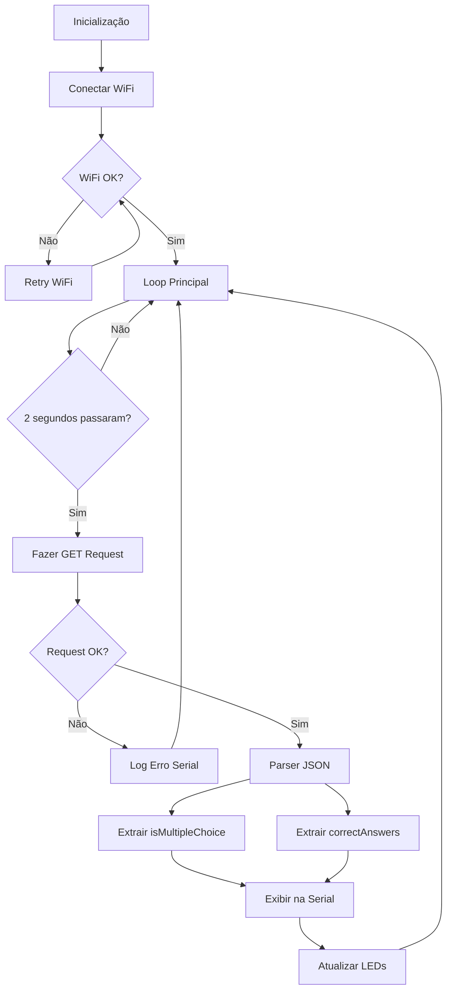

# Plano de Implementação: Sistema de Polling ESP8266 com LEDs

## Visão Geral do Projeto

Desenvolver um sistema de polling para D1 Mini (ESP8266) que:
- Conecta-se ao WiFi com credenciais hardcoded
- Faz requisições HTTP GET a cada 2 segundos ao endpoint da API
- Parseia o JSON para extrair `isMultipleChoice` e `correctAnswers`
- Controla 5 LEDs baseado nas respostas corretas recebidas
- Exibe dados na Serial para validação

## Arquitetura do Sistema



## Configuração de Hardware

### Mapeamento de Pinos D1 Mini

| LED | Cor | Pino GPIO | Pino D1 Mini | Função |
|-----|-----|-----------|--------------|---------|
| A | Verde | GPIO0 | D3 | Resposta Correta A |
| B | Amarelo | GPIO4 | D2 | Resposta Correta B |
| C | Vermelho | GPIO14 | D5 | Resposta Correta C |
| D | Azul | GPIO5 | D1 | Resposta Correta D |
| E | Branco | GPIO13 | D7 | Resposta Correta E |

### Esquema de Conexão
```
D1 Mini          LED
--------        -----
D3 (GPIO0)  --> LED A (Verde) + Resistor 220Ω --> GND
D2 (GPIO4)  --> LED B (Amarelo) + Resistor 220Ω --> GND
D5 (GPIO14) --> LED C (Vermelho) + Resistor 220Ω --> GND
D1 (GPIO5)  --> LED D (Azul) + Resistor 220Ω --> GND
D7 (GPIO13) --> LED E (Branco) + Resistor 220Ω --> GND
```

## Bibliotecas Necessárias

### 1. ESP8266WiFi
- **Propósito**: Gerenciamento de conexão WiFi
- **Funcionalidades**: WiFi.begin(), WiFi.status(), WiFi.connected()

### 2. ESP8266HTTPClient
- **Propósito**: Realizar requisições HTTP
- **Funcionalidades**: http.begin(), http.GET(), http.getString()

### 3. WiFiClientSecure
- **Propósito**: Suporte para HTTPS (requisição usa https://)
- **Funcionalidades**: Conexão segura SSL/TLS
- **Configuração**: setInsecure() para certificados auto-assinados

### 4. ArduinoJson
- **Propósito**: Parser e manipulação de JSON
- **Versão Recomendada**: 6.x ou superior
- **Funcionalidades**: deserializeJson(), JsonDocument
- **Instalação**: Library Manager do Arduino IDE

## Estrutura do Código

### Componentes Principais

#### 1. Definições e Configurações
```cpp
// WiFi credentials (hardcoded)
const char* ssid = "Sagaz";
const char* password = "Amarelo%4815";

// API endpoint
const char* apiUrl = "https://certapi.proera.com.br/api/Esp8266/poll";

// LED pins
#define LED_A D3  // GPIO0
#define LED_B D2  // GPIO4
#define LED_C D5  // GPIO14
#define LED_D D1  // GPIO5
#define LED_E D7  // GPIO13

// Polling interval
const unsigned long POLLING_INTERVAL = 2000; // 2 segundos
```

#### 2. Função de Conexão WiFi
- Tenta conectar ao WiFi
- Implementa retry com timeout
- Exibe status na Serial
- Trata falhas de conexão

#### 3. Função de Requisição HTTP
- Cria cliente HTTPS seguro
- Configura headers (Accept: text/plain)
- Executa GET request
- Retorna response body
- Trata erros HTTP (timeout, 404, 500, etc.)

#### 4. Parser JSON
- Recebe string JSON
- Extrai campo `isMultipleChoice` (boolean)
- Extrai array `correctAnswers` (array de strings)
- Valida estrutura JSON
- Trata erros de parsing

#### 5. Controle de LEDs
- Desliga todos os LEDs inicialmente
- Liga LEDs correspondentes às respostas corretas
- Exemplo: Se correctAnswers = ["A", "C"], liga LEDs A e C

#### 6. Sistema de Polling Não-Bloqueante
- Usa `millis()` para controle de tempo
- Evita `delay()` que bloquearia o sistema
- Mantém estado do último polling
- Permite outras operações durante espera

#### 7. Saída Serial
- Exibe dados extraídos do JSON
- Formato: "isMultipleChoice: true/false"
- Formato: "correctAnswers: [A, C]"
- Debug de erros e status

## Fluxo de Dados

### Request/Response

**Request:**
```http
GET /api/Esp8266/poll HTTP/1.1
Host: certapi.proera.com.br
Accept: text/plain
```

**Response:**
```json
{
  "hasData": true,
  "itemId": "c61b5e4b-67a0-4548-9500-7e90ecd619b8",
  "data": {
    "isMultipleChoice": false,
    "correctAnswers": ["A"],
    "explanation": "...",
    "analyzedAt": "2026-01-09T20:18:28.6459736Z"
  },
  "message": "Data retrieved successfully"
}
```

**Dados Extraídos:**
- `data.isMultipleChoice` → boolean
- `data.correctAnswers` → array de strings

### Exemplo de Saída Serial

```
=================================
Conectando ao WiFi...
WiFi conectado!
IP: 192.168.1.100
=================================

[Poll #1] Requisição iniciada...
Status HTTP: 200
Response recebido com sucesso!

--- Dados Extraídos ---
isMultipleChoice: false
correctAnswers: [A]
-----------------------

LEDs atualizados:
✓ LED A: LIGADO
  LED B: DESLIGADO
  LED C: DESLIGADO
  LED D: DESLIGADO
  LED E: DESLIGADO

Aguardando próximo poll...
```

## Tratamento de Erros

### Cenários de Erro

1. **WiFi não conecta**
   - Retry automático a cada 5 segundos
   - Exibir status na Serial
   - LEDs permanecem desligados

2. **Request HTTP falha**
   - Log do erro HTTP na Serial
   - Continuar polling normalmente
   - Manter último estado dos LEDs

3. **JSON inválido ou malformado**
   - Log do erro de parsing
   - Não atualizar LEDs
   - Continuar polling

4. **Campo ausente no JSON**
   - Usar valores padrão (isMultipleChoice: false, correctAnswers: [])
   - Log de warning na Serial

5. **Resposta vazia (hasData: false)**
   - Desligar todos os LEDs
   - Exibir mensagem na Serial

## Considerações Técnicas

### Memória e Performance
- ESP8266 tem ~80KB RAM disponível
- ArduinoJson requer buffer adequado (1024 bytes recomendado)
- Evitar String concatenation excessiva
- Usar `const char*` onde possível

### Segurança HTTPS
- API usa HTTPS, requer WiFiClientSecure
- `setInsecure()` desabilita validação de certificado
- Para produção, considerar validação com fingerprint

### Timing Não-Bloqueante
- `millis()` overflow após ~49 dias (tratado automaticamente)
- Polling interval preciso: 2000ms
- Não usar `delay()` no loop principal

### Serial Monitor
- Baud rate: 115200 (padrão ESP8266)
- Encoding: UTF-8 para caracteres especiais
- Newline: Both NL & CR

## Dependências de Bibliotecas

### Instalação via Arduino IDE Library Manager

1. **ArduinoJson** by Benoit Blanchon
   - Versão: ≥ 6.21.0
   - Instalar via: Sketch → Include Library → Manage Libraries → "ArduinoJson"

2. **ESP8266WiFi** (built-in)
   - Incluída no ESP8266 Board Package
   - Board Manager: esp8266 by ESP8266 Community

3. **ESP8266HTTPClient** (built-in)
   - Incluída no ESP8266 Board Package

### Configuração da Board no Arduino IDE

1. Adicionar Board Manager URL:
   - `http://arduino.esp8266.com/stable/package_esp8266com_index.json`

2. Instalar ESP8266 Board Package:
   - Tools → Board → Boards Manager → "esp8266"

3. Selecionar Board:
   - Tools → Board → ESP8266 Boards → "LOLIN(WEMOS) D1 R2 & mini"

4. Configurações de Upload:
   - Upload Speed: 921600
   - CPU Frequency: 80 MHz
   - Flash Size: 4MB (FS:2MB OTA:~1019KB)
   - Port: Selecionar porta COM correta

## Validação e Testes

### Checklist de Testes

- [ ] WiFi conecta com sucesso
- [ ] Requisição HTTP GET executa sem erros
- [ ] JSON é parseado corretamente
- [ ] `isMultipleChoice` é extraído e exibido na Serial
- [ ] `correctAnswers` é extraído e exibido na Serial
- [ ] LEDs acendem conforme respostas corretas
- [ ] Polling ocorre a cada 2 segundos
- [ ] Sistema recupera de erros de conexão
- [ ] Saída Serial está legível e informativa
- [ ] Memória não estoura durante execução

### Casos de Teste

**Teste 1: Resposta Única**
```json
"correctAnswers": ["A"]
```
- Resultado esperado: Apenas LED A aceso

**Teste 2: Múltiplas Respostas**
```json
"correctAnswers": ["A", "C", "E"]
```
- Resultado esperado: LEDs A, C e E acesos

**Teste 3: isMultipleChoice Variações**
```json
"isMultipleChoice": true
"isMultipleChoice": false
```
- Resultado esperado: Valor correto exibido na Serial

**Teste 4: Sem Dados**
```json
"hasData": false
```
- Resultado esperado: Todos LEDs apagados, mensagem na Serial

## Próximos Passos

Após aprovação deste plano, o código será implementado no modo **Code** seguindo esta arquitetura detalhada.
